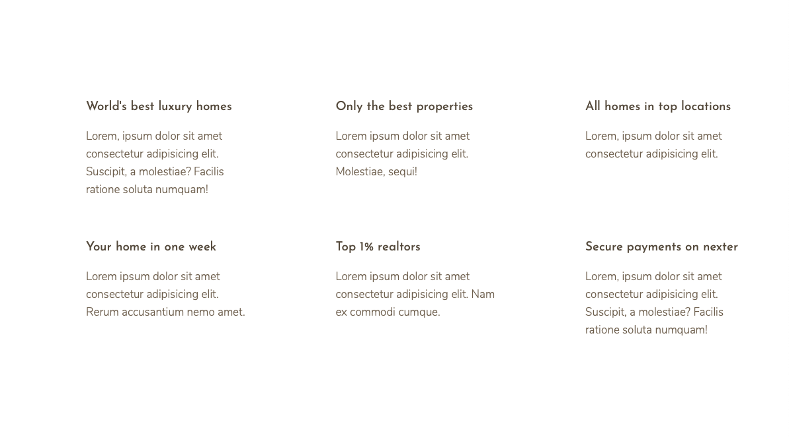
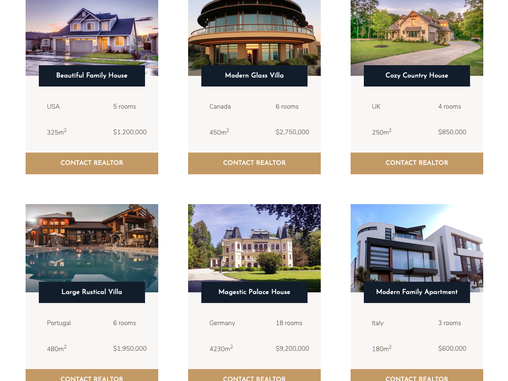
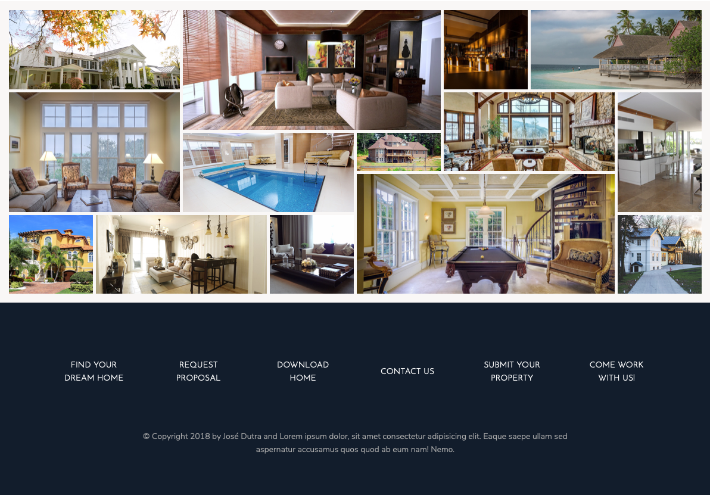

# Realtors Nexter

## Nexter is a front-end project based on a PSD/SKETCH designed by Jonas Schmedtmann - Designer

### This project is part of an advanced CSS course

### Front-end

- HTML
- JavaScript (jQuery)
- CSS & SASS
- Responsive Design
- Grid System

---

### npm dev-dependencies

- autoprefixer
- concat
- node-sass
- npm-run-all
- postcss-cli

---

## Live Demo

### https://dutraneto.gitlab.io/2018-frontend-nexter

---

### Screenshots

### TODO
